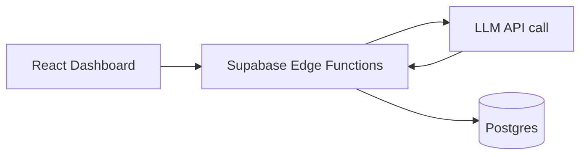
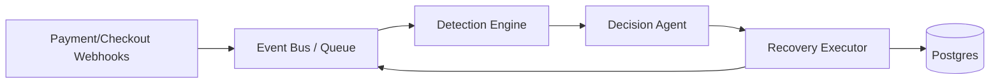
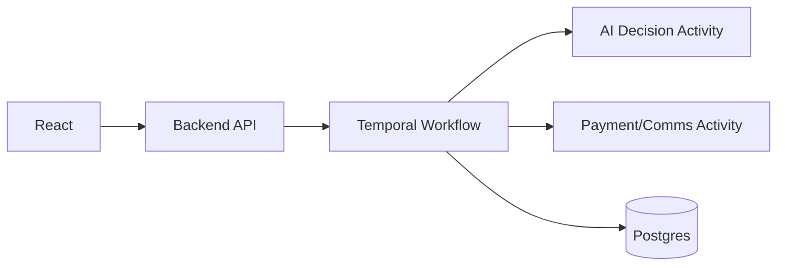
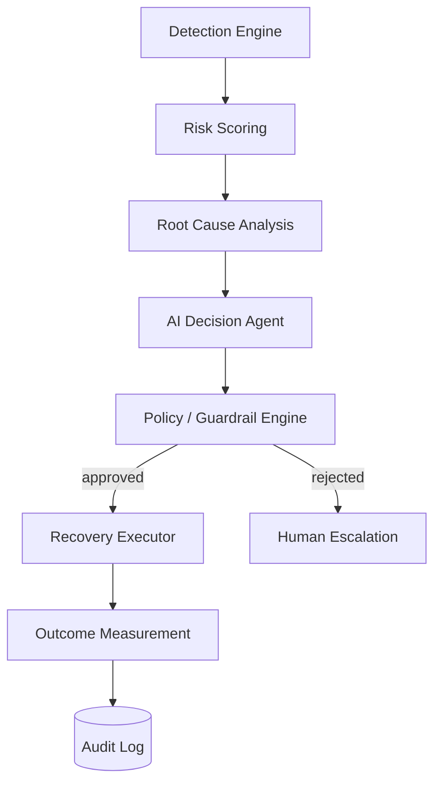
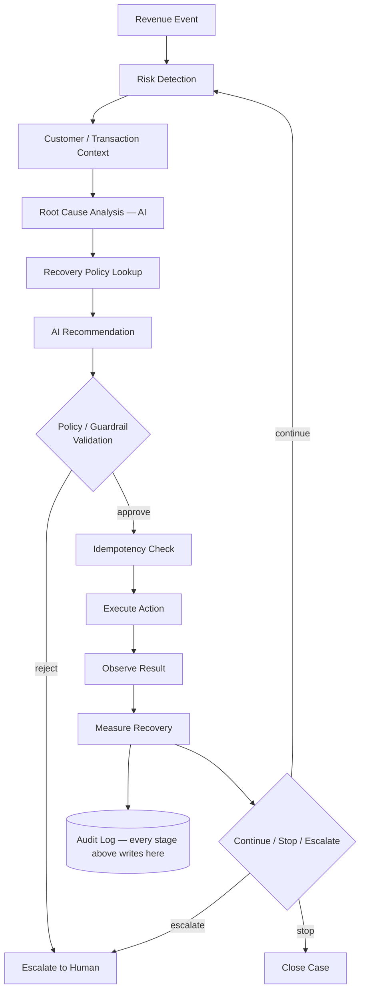
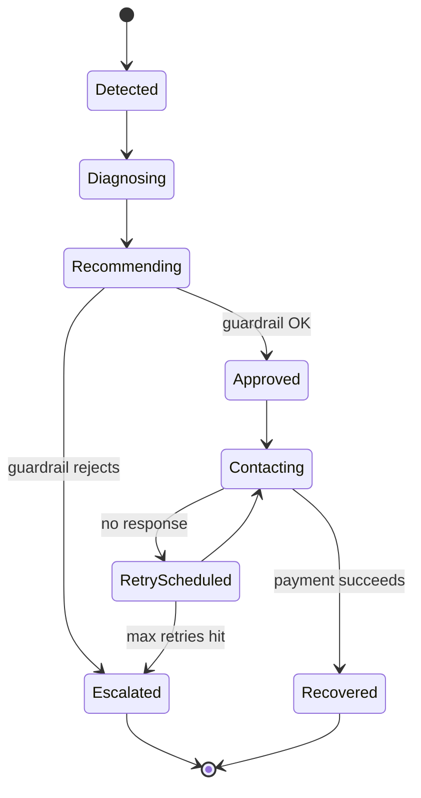
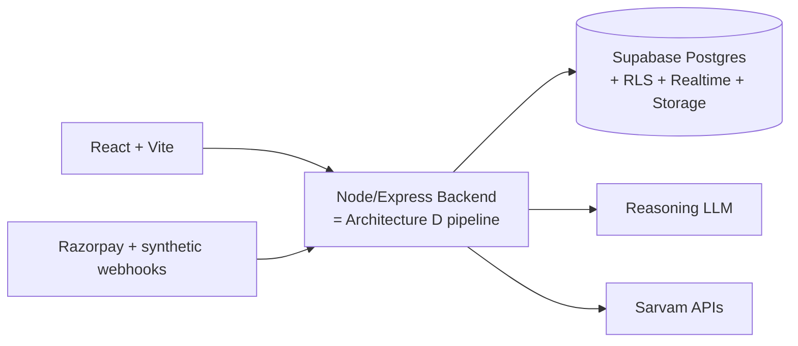

# AI Revenue Recovery — System Architecture
### Razorpay `/buildathon` — Track 03

**Editorial note:** Your brief asks for 17 evaluation dimensions repeated across 4 architectures — that's 68 write-ups, which would bury the useful signal. Instead, each architecture gets a tight "how it works" + diagram + verdict, and all 17 dimensions are compared once in a single decision matrix (Section 3). Depth is concentrated on the architecture you should actually build (Section 6 onward).

---

## 1. The Architectural Decisions That Actually Matter

Before picking a stack, six decisions determine everything else:

| # | Decision | Options | This doc recommends |
|---|---|---|---|
| 1 | Sync vs event-driven | Direct function calls / DB triggers / real message bus | **DB-backed event log, no external broker** — see §7 |
| 2 | Who executes money-moving actions | LLM with tool-calling / deterministic engine validated by LLM | **Deterministic executor only; LLM proposes, never executes** — see §5 |
| 3 | Workflow durability | In-process state machine / durable workflow engine (Temporal) | **In-process for hackathon, Temporal for production** — see §15 |
| 4 | Sarvam's job | Everything language / narrow slice | **STT, TTS, and Hinglish generation only — not reasoning** — see §8 |
| 5 | One model vs many | Single LLM does classification + reasoning + language | **Reasoning model + Indic language model, split by task** — see §9 |
| 6 | Where audit trail lives | Application logs / dedicated DB tables | **Dedicated append-only Postgres tables, not logs** — see §6 |

Everything below justifies these six calls.

---

## 2. Four Architecture Options

### A — Simple Supabase-Centric

**How it works:** React calls an Edge Function per user action; the function calls an LLM inline and writes the result to Postgres. No separation between "detect," "decide," and "act" — it's one function doing everything.

**Verdict — insufficient alone.** This is exactly the `React → ChatGPT → Supabase` toy pattern the brief warns against. There's no place for a policy/guardrail check to live, no natural audit trail (you'd have to remember to log manually at every call site), and "stopping rules" become scattered `if` statements instead of a real property of the system. Fine as a UI shell; wrong as the whole architecture.

### B — Event-Driven Recovery Engine

**How it works:** A real broker (Kafka / RabbitMQ / cloud queue) decouples ingestion from processing; each stage is an independent consumer.

**Verdict — right shape, wrong weight for a hackathon.** This is the correct *mental model*, but standing up Kafka/RabbitMQ for a weekend build burns hours on infra you won't finish debugging, for scale you don't have. The useful part of this pattern — decoupled stages, replayable events — can be had with a Postgres outbox table instead of a broker. Keep the shape, drop the infra (see Architecture D+).

### C — Workflow-Orchestrator (Temporal)

**How it works:** Every recovery case is a durable Temporal workflow. Retries, backoff, timers ("wait 3 days for promise-to-pay"), and cancellation are first-class, survive crashes, and are visible in Temporal's UI.

**Verdict — the correct production architecture, premature for a hackathon.** Temporal genuinely solves "mandate retry sequencer" and "promise-to-pay tracker" better than anything else on this list — those are long-running-timer problems by nature. But learning Temporal's SDK, running its server, and wiring activities is 4–8 hours of setup a student team doesn't have. Land here in production (§15), not in the demo.

### D — Hybrid AI Agent Architecture *(recommended base)*

**How it works:** A deterministic pipeline of named stages, where exactly one stage (the AI Decision Agent) calls an LLM, and its output is a *proposal* — a structured object — not an executed action. Every other stage is plain code you can unit-test.

**Verdict — best sophistication-to-effort ratio.** This is what we build. It gives you the exact "Detect → Diagnose → Decide → Act → Measure → Stop/Escalate → Audit" loop the brief asks for, using only a Postgres database and a single backend service — no broker, no workflow engine — while still being architecturally honest about where AI reasoning ends and financial execution begins. It's also the only one of the four that evolves cleanly into C (each pipeline stage becomes a Temporal activity later) and B (the outbox table becomes a real topic later) without a rewrite.

---

## 3. Architecture Decision Matrix

| Criterion | A. Supabase-only | B. Event-driven (real broker) | C. Temporal | D. Hybrid Agent *(chosen)* |
|---|---|---|---|---|
| Hackathon build time | Very low | High (broker setup) | Very high (learning curve) | **Low–medium** |
| "Genuinely agentic" feel for judges | Weak — looks like a chatbot | Strong | Strong | **Strong** |
| Auditability | Manual, inconsistent | Good (event log) | Excellent (built-in history) | **Good** (dedicated tables) |
| Stopping rules / bounded behavior | Ad hoc | Possible, more code | Native (timers, cancellation) | **Native to pipeline** |
| Handles long-running cases (promise-to-pay, mandate retries) | Poorly | OK with cron | **Excellent** | OK for demo scale |
| Infra to run/debug live at judging | None | Broker + consumers | Temporal server + workers | **One backend + Postgres** |
| Scalability ceiling | Low | High | High | Medium (fine for a batch demo) |
| Production readiness as-is | No | Close | Yes | No — needs §15 evolution |
| Cost | ~$0 | Broker hosting cost | Temporal Cloud or self-host | **~$0** |
| Risk of over-engineering for a weekend | Low | **High** | **Very high** | Low |

**Read:** D wins on the two things that actually decide hackathon outcomes — can you finish it, and does it look real to a judge who builds this stuff for a living — without giving up the audit trail and guardrail structure the brief explicitly grades on.

---

## 4. What Can Go Wrong — Failure Modes and Mitigations

| Failure | Mitigation in Architecture D |
|---|---|
| AI hallucinates a root cause or action | Guardrail engine validates the proposal against a strict JSON schema + enum of allowed action types; anything outside the enum is auto-rejected, never executed |
| Incorrect recovery action chosen | Guardrail checks action against case state (e.g., can't "retry payment" on a case already marked recovered); mismatches route to escalation, not execution |
| Duplicate payment/retry | Every executor call requires a caller-generated `idempotency_key`; the executor checks `idempotency_keys` before calling any external API |
| Repeated customer messaging | `communication_attempts` enforces a cooldown window per `(case_id, channel)`; guardrail blocks a second message inside the cooldown |
| Infinite retry loops | Deterministic `max_retry_count` and `max_campaign_duration` live in `policy_rules`, not in the LLM prompt — the agent cannot argue its way past them |
| Wrong customer segmentation | Segmentation is a deterministic scoring function (§9), not an LLM judgment call — same inputs always produce the same segment |
| Incorrect revenue attribution | Recovery is only counted against a case with a matched `recovery_action_id`; §11 defines a holdout group so "recovered anyway" isn't over-claimed |
| API failure (payment/comms provider) | Executor treats every external call as at-least-once with retry + exponential backoff, gated by idempotency key |
| Webhook duplication | `webhook_events` table keyed on provider event ID; duplicates are stored but marked `processed=false → skip` |
| Webhook out-of-order arrival | Events carry provider timestamps; case state transitions are validated against a state machine, so an out-of-order "succeeded" after "failed" is checked, not blindly applied |
| Payment gateway timeout | Treated as "unknown outcome," not "failed" — case goes to a reconciliation step before any recovery action fires, avoiding a wrong diagnosis |
| Database failure | Supabase Postgres has built-in point-in-time recovery; executor is written so a mid-write crash leaves the case in a re-checkable state, not a corrupted one |
| AI provider outage | Guardrail engine has a deterministic fallback playbook (e.g., default retry schedule) so cases don't stall — they just lose the "smart" recommendation temporarily |
| Sarvam API outage | Falls back to English template messages via the primary LLM; voice channel degrades to text-only, logged as a degraded-mode case |
| Customer responds unexpectedly | Anything the intent classifier doesn't map to a known intent routes to human escalation by default — no silent guesswork |
| Customer asks for a human | Explicit intent → immediate escalation, bypasses all further automation on that case |
| Customer promises to pay but doesn't | `promises_to_pay` has a `promised_date`; a scheduled check marks it broken and re-triggers the pipeline, doesn't just wait forever |
| Recovery succeeds but webhook is delayed | Case has a "pending confirmation" state distinct from "recovered" — money isn't counted until the webhook lands |
| Recovery action executed twice | Prevented at the source by idempotency keys, not caught after the fact |
| Merchant config changes mid-campaign | Policy rules are read fresh per pipeline run, not cached at campaign start, so a merchant lowering their retry limit takes effect immediately |

---

## 5. Agent Architecture — Bounded, Not Autonomous

### AI decisions vs deterministic decisions

| AI (LLM) decides | Deterministic code decides |
|---|---|
| Likely root cause of a payment failure, given context | Maximum retry count, campaign duration |
| Recovery probability / which segment a customer falls in *(recommend only — see §9 note)* | Allowed action types, payment amount limits |
| Which channel/tone fits this customer | Cooldown period, contact frequency |
| Draft message content and language | Escalation conditions, compliance rules |
| Whether the situation looks unusual enough to escalate | Idempotency, audit logging |
| What the customer's reply means (intent) | Whether an action is *permitted* given current case state |

**Why this split:** an LLM is good at judgment calls with ambiguous inputs (tone, likely cause, message wording) and bad at being a source of truth for limits and compliance (it can be argued with, it drifts, it isn't deterministic between runs). Anything where "the same inputs must always produce the same answer" — retry limits, amount caps, cooldowns — is regular code. The LLM never gets a code path to a payment or messaging API; it only ever returns a structured recommendation object that the guardrail engine evaluates.

### The bounded agent loop



The one addition to your original loop: an explicit **Idempotency Check** between guardrail approval and execution. "Policy said yes" and "safe to actually call the API right now" are different questions — the first is about whether the action *should* happen, the second is about whether it has *already* happened. Collapsing them is a common source of duplicate charges/messages.

---

## 6. Database Schema (Postgres / Supabase)

| Table | Key fields | Relationships | Append-only? | RLS? | Idempotency key? | Notes |
|---|---|---|---|---|---|---|
| `merchants` | id, name, config (jsonb) | root of tenancy | No | Yes (own row) | — | `config` holds per-merchant policy overrides |
| `customers` | id, merchant_id, contact info, language_pref | → merchants | No | Yes (by merchant_id) | — | `language_pref` drives Sarvam routing |
| `transactions` | id, merchant_id, customer_id, amount, status, gateway_ref | → merchants, customers | No | Yes | Yes (`gateway_ref`) | Source of truth for "did money move" |
| `payments` | id, transaction_id, status, failure_code, attempted_at | → transactions | Yes (new row per attempt) | Yes | Yes | Never update in place — append each attempt |
| `subscriptions` | id, merchant_id, customer_id, status, next_charge_at | → merchants, customers | No | Yes | — | |
| `invoices` | id, merchant_id, customer_id, amount, due_date, status | → merchants, customers | No | Yes | — | B2B receivables source |
| `revenue_risk_events` | id, source_event_id, type, transaction_id/invoice_id, detected_at | → transactions/invoices | **Yes** | Yes | Yes (`source_event_id`) | The "outbox"/event log — §7 |
| `risk_scores` | id, event_id, score, factors (jsonb) | → revenue_risk_events | Yes | Yes | — | Deterministic scoring output |
| `root_cause_analysis` | id, event_id, cause, confidence, model_used | → revenue_risk_events | Yes | Yes | — | AI output, stored verbatim for audit |
| `recovery_cases` | id, event_id, customer_id, state, opened_at, closed_at | → revenue_risk_events, customers | No (state machine) | Yes | — | One row per active recovery |
| `recovery_actions` | id, case_id, action_type, proposed_by, status | → recovery_cases | Yes | Yes | Yes | `proposed_by` = 'ai' or 'policy_default' |
| `recovery_campaigns` | id, merchant_id, name, started_at, stopping_rules (jsonb) | → merchants | No | Yes | — | Batch-level grouping for the demo dashboard |
| `communication_attempts` | id, case_id, channel, sent_at, cooldown_until | → recovery_cases | **Yes** | Yes | Yes | Cooldown enforcement lives off this table |
| `promises_to_pay` | id, case_id, promised_date, status | → recovery_cases | No (status updates) | Yes | — | Checked by a scheduled job |
| `agent_decisions` | id, case_id, stage, input (jsonb), output (jsonb), model, latency_ms | → recovery_cases | **Yes** | Yes | — | The core audit/timeline table — powers the Agent Timeline UI |
| `policy_rules` | id, merchant_id, rule_type, params (jsonb) | → merchants | No | Yes | — | Read fresh per run, not cached (see failure table) |
| `escalations` | id, case_id, reason, escalated_at, resolved_at | → recovery_cases | No | Yes | — | |
| `audit_logs` | id, actor, action, entity, before, after, at | polymorphic | **Yes** | Yes | — | Generic audit; `agent_decisions` is the AI-specific specialization |
| `webhook_events` | id, provider, provider_event_id, payload, processed | — | **Yes** | Yes | Yes (`provider_event_id`) | Raw inbound events before normalization |
| `idempotency_keys` | key, action_type, used_at | referenced by actions | Yes | Yes | is the key | Checked before every external call |
| `experiment_results` | id, campaign_id, holdout_group, outcome | → recovery_campaigns | Yes | Yes | — | Powers the incrementality claim in §11 |

**What should *not* live in Postgres:**
- Raw voice recordings → Supabase Storage (or S3), with only a URL reference in `communication_attempts`.
- Streaming/interim STT transcripts → keep in memory during the call; persist only the final transcript.
- High-churn ephemeral counters (e.g., "requests this minute" for rate limiting) → fine in Postgres at hackathon volume; move to Redis in production.

---

## 7. Event Architecture — Outbox, Not a Broker

| Approach | Verdict for this project |
|---|---|
| Direct synchronous calls | Fine for UI → API, wrong for "detect → agent → execute" — no replay, no decoupling |
| Supabase DB triggers | Good for cheap fan-out (e.g., notify Realtime channel on insert) |
| Supabase Edge Functions | Good for webhook *receivers* specifically; less good as the home for the whole agent loop (execution time limits, harder to debug live) |
| Webhooks (inbound) | Required — this is how `payment_failed`, `subscription_payment_failed` etc. actually arrive |
| Kafka / RabbitMQ / cloud queues | **Skip for the hackathon.** Real infra, real ops burden, no payoff at demo scale |
| Redis Streams | The right *production* upgrade from the outbox pattern below — lightweight, ordered, replayable |

**Hackathon pattern:** every inbound signal (`payment_failed`, `checkout_abandoned`, `invoice_overdue`, `customer_responded`, `promise_to_pay_broken`, …) is normalized into a row in `revenue_risk_events` (the outbox). The backend service subscribes to inserts via **Supabase Realtime** (or a simple short-interval poll if Realtime is flaky under demo conditions) and runs the pipeline per new row. This gives you: decoupled stages, a literal replayable event log for the audit trail, and zero extra infrastructure — the entire "event bus" is one Postgres table. Do not reach for Kafka because it's "more architecturally correct" — it is correct for volumes and team sizes you don't have this weekend.

---

## 8. Sarvam AI Integration Strategy

*(Verified against current Sarvam docs — the buildathon prompt correctly flagged that these names drift, and they have since the last major update: STT is now on **Saaras v3**, not the older Saarika-only stack, and TTS is on **Bulbul v3**.)*

**Current Sarvam surface relevant here:** Speech-to-Text (Saaras v3 — supports `transcribe`, `translate`, `verbatim`, `translit`, and, notably, a **`codemix` mode built for exactly this Hinglish use case**), Speech-to-Text-Translate, Text-to-Speech (Bulbul v3), Text Translation (Mayura / Sarvam-Translate), Transliteration, Language Identification (`text-lid`), and a general chat-completion endpoint backed by Sarvam-105B.

**Where Sarvam should sit — and where it shouldn't:**

| Task | Use Sarvam? | Why |
|---|---|---|
| Transcribing a customer's voice reply | **Yes — Saaras v3, `codemix` mode** | Purpose-built for mixed Hindi-English speech; a general STT model will mis-transcribe code-switching |
| Detecting whether a text reply is Hindi/English/Hinglish | **Yes — `text-lid`** | Cheap, fast, purpose-built — no need to ask a general LLM to classify language |
| Generating the actual Hinglish/regional-language message sent to the customer | **Yes — Sarvam chat completion / Mayura for translation** | Natural code-mixing is Sarvam's specialty; a general-purpose LLM's Hinglish reads stiff and over-translated |
| Speaking the reply back on a voice channel | **Yes — Bulbul v3** | Natural-sounding Indic TTS |
| Root-cause reasoning ("why did this payment fail") | **No — general reasoning LLM** | This is structured, financial reasoning over transaction metadata, not a language task |
| Deciding the next action / retry strategy | **No — general reasoning LLM + policy engine** | Same reason; language model choice here should optimize for reasoning quality, not Indic fluency |
| Root-cause / decision output that will be shown in English on the merchant dashboard | **No** | No translation needed — keep this path on the reasoning model |

**Design calls:**
- **Translate *after* reasoning, not before.** Run root-cause analysis and decision-making on the English/structured representation of the case (transaction metadata is already structured; if the customer's reply needs to feed reasoning, get an English transcript from Saaras v3's `translate` mode). Only the final customer-facing message goes through Sarvam for natural Hinglish generation. This keeps your reasoning prompts language-agnostic and cheap, and puts the harder "sound natural in Hinglish" problem where Sarvam is actually specialized.
- **Preserve tone by keeping the original transcript too.** Store both the `codemix` transcript (what they actually said) and the English translation (what you reasoned over) in `communication_attempts` — the codemix version is what a human reviewer needs to sanity-check the AI's reply.
- **Latency:** STT → reason → generate → TTS is a real chain; for the demo, don't do this live on a phone call — use recorded/simulated voice snippets and show the pipeline stages in the Agent Timeline instead of building a live call system.
- **Cost:** batch/REST endpoints (not the realtime websocket) are enough for a demo; the websocket streaming variant is a production concern, not a hackathon one.
- **If Sarvam is unavailable:** fall back to English template messages generated by the primary reasoning LLM, and flag the case as "degraded mode" in the audit log rather than failing silently.

---

## 9. AI Model Strategy

| Option | Verdict |
|---|---|
| 1. One LLM for everything | Rejected — forces a single model to be simultaneously good at financial reasoning and natural Hinglish, and gives it a straight line to "just call the payment API," which conflicts with the guardrail requirement |
| 2. LLM + deterministic rules | Necessary baseline, but doesn't say which LLM(s) |
| 3. Small/cheap classifier + powerful reasoner | Good instinct, but classification here (intent, language ID) is cheap enough to not need a separate fine-tuned model — Sarvam's `text-lid` and a structured-output prompt cover it |
| 4. Specialized language model + separate reasoning model | **This, combined with 5** |
| 5. Mostly deterministic, AI only where ambiguous | **This is the actual backbone — see §5's split table** |

**Recommendation: Option 4+5 combined.** A general reasoning model (Claude/GPT-class) handles root-cause analysis and action recommendation as structured JSON output (function-calling schema, not free text) — this is where you want the strongest general reasoning available. Sarvam handles every Indic-language-facing task (§8). Deterministic code owns every limit, cap, and compliance rule. No model — general or Sarvam — is ever given a tool that can move money or is trusted to enforce a limit; it only ever proposes, and the guardrail engine (plain code, unit-testable, no LLM in the loop) is what actually gates execution. This is the direct answer to your stated preference: **the AI cannot execute unrestricted financial actions because it is never given an execution-capable tool at all — only a "propose" function whose output is validated before anything runs.**

---

## 10. Recovery Playbooks

### Failed Subscription
- **Trigger:** `subscription_payment_failed` webhook
- **States:** `detected → diagnosing → recommending → awaiting_approval → contacting → retry_scheduled → recovered | escalated | closed_unrecovered`
- **AI decides:** likely failure reason (card expired vs insufficient funds vs bank decline), message tone/channel
- **Deterministic:** max 3 retries, minimum 24h between retries, hard stop at 14 days
- **Stopping condition:** `max_retry_count` reached or customer opts out
- **Escalation:** customer explicitly requests human, or failure reason is `suspected_fraud`
- **Success metric:** subscription payment succeeds within the campaign window

### Checkout Abandonment
- **Trigger:** `checkout_abandoned` (cart created, no payment within N minutes)
- **States:** `abandoned → scored → intervention_selected → messaged → returned | expired`
- **AI decides:** abandonment reason if inferable (price, payment method friction, indecision), which nudge to send
- **Deterministic:** one message per abandonment (no repeat nagging), campaign expires at 48h
- **Success metric:** checkout completed after intervention, attributed via §11's holdout method

### B2B Receivables
- **Trigger:** `invoice_overdue`
- **States:** `overdue → scored → contacted → promise_to_pay | escalated → paid | broken_promise → re-engage | write_off_flagged`
- **AI decides:** personalized reminder tone based on relationship history, what a "promise to pay" reply actually means
- **Deterministic:** escalation to human collections after 2 broken promises; compliance-mandated contact frequency caps
- **Success metric:** invoice paid; secondary metric — accurate promise-to-pay tracking rate



---

## 11. Revenue Measurement — Avoiding a Misleading Number

The brief's headline metric ("show measured money recovered") is easy to fake and easy to judge harshly if it looks faked. Define it carefully:

- **Revenue at risk:** sum of `transactions`/`invoices` value entering a `revenue_risk_events` row in the campaign window.
- **Revenue recovered (gross):** sum of amounts where the case reached `recovered` state **and** a matching success webhook confirmed it (not just "action executed").
- **Revenue recovered (net-of-agent, i.e. incremental):** this is the number judges will actually respect. Run a **holdout group** — a fixed percentage of at-risk cases get *no* agent intervention, tracked identically. Incremental recovery = (recovery rate in treated group − recovery rate in holdout group) × revenue at risk. This directly answers "would this have recovered anyway?" instead of asserting it.
- **Recovery rate:** recovered / at risk, reported for both treated and holdout groups side by side.
- **Recovery cost:** (LLM tokens + Sarvam API calls + messaging cost) per recovered case — cheap to compute, and including it unprompted signals maturity to a judge.
- **Recovery time:** median time from `detected` to `recovered`.

**Dashboard funnel (as you sketched, extended with the honest layer):**
```
₹24.6L Revenue at Risk
     ↓
₹8.7L Gross Recovered        ← includes cases that might have paid anyway
     ↓
₹5.2L Incremental Recovered  ← gross minus estimated holdout-group baseline
     ↓
35.4% Recovery Rate (treated)   vs   19.1% (holdout)
```
Showing the holdout comparison *is* how you avoid the misleading-metrics trap — it's more convincing than a bigger gross number, not less.

---

## 12. Frontend Architecture

**Stack:** React + Vite + TanStack Query (for `recovery_cases`/`agent_decisions` fetching) + Supabase Realtime subscription (for the live Agent Timeline) + Tailwind + Recharts. No Redux/Zustand needed — server state via TanStack Query and a small amount of local UI state is enough for this scope.

**Screens:**
- **Executive Dashboard** — the funnel from §11, active case count, escalation rate.
- **Recovery Cases** — table: customer, amount, risk score, root cause, state, next action, AI confidence; filterable by campaign.
- **Agent Timeline** (per case) — chronological feed straight off `agent_decisions`, exactly like your sketch (`10:31 — Payment failed`, `10:32 — Hinglish intervention selected`, …). This table doubles as your audit trail — don't build a separate rendering path for "timeline" vs "audit," they're the same data at different levels of detail.
- **Audit Trail** — same feed, unfiltered, with the raw `input`/`output` JSON expandable per stage — this is what proves "explainable" to a judge who clicks in.
- **Campaign Analytics** — batch-level view: treated vs holdout comparison, cost per recovery, recovery time distribution.

**Suggested structure:**
```
src/
  features/
    dashboard/
    cases/
    timeline/
    campaigns/
  components/ui/        (shared primitives)
  lib/supabase.ts
  lib/api.ts
```

---

## 13. Security Model

- **Service-role key never reaches the frontend** — only the backend holds it; frontend uses the anon key + RLS.
- **RLS on every merchant-scoped table**, keyed on `merchant_id`, tested with at least two fake merchants during the hackathon so cross-tenant leakage is actually verified, not assumed.
- **Webhook signature verification** on every inbound provider webhook before it's trusted enough to become a `revenue_risk_events` row.
- **Idempotency keys** as already covered — this is a security property as much as a correctness one (prevents replay-triggered duplicate charges).
- **The guardrail engine is the actual security boundary against the AI**, not a prompt instruction. The LLM is given a function-calling schema that can only return a *proposal* object — it has no credential, no API client, and no code path to a payment or messaging provider. This is the concrete answer to "how do you prevent unauthorized financial actions": the model is architecturally incapable of taking one, not merely told not to.
- **Prompt injection:** customer replies are data, never instructions — they're passed to the LLM inside a clearly delimited "customer said" field in a structured prompt, and the model's output is constrained to the same proposal schema regardless of what the input contains. A customer's message can influence what's *proposed*, never what's *executed*.
- **PII:** phone numbers, voice recordings, and transcripts are the sensitive surface — Storage bucket access rules should mirror the RLS tenant boundary, and raw audio shouldn't be logged into `agent_decisions` (store a reference, not the blob).
- **Rate limiting** on the AI-facing endpoints — cheap to add (per-merchant token bucket) and prevents a runaway loop from becoming a cost incident.

---

## 14. Observability — Build vs Mock

| Build for real | Mock/skip for the demo |
|---|---|
| `agent_decisions` as structured logs (this *is* your observability, not an add-on) | Full OpenTelemetry distributed tracing — one service doesn't need it |
| Basic latency timestamp per pipeline stage (already in `agent_decisions`) | Queue depth monitoring — there's no queue |
| A simple cost counter (tokens × price, Sarvam calls × price) per case | A real cost dashboard/alerting system — a number on the campaign screen is enough |
| Escalation rate, recovery conversion rate (both are just queries against your existing tables) | Anomaly detection / alerting pipeline |

---

## 15. Hackathon Architecture vs Production Evolution

**Hackathon (build this):**

One frontend, one backend service, one database. No broker, no workflow engine, no microservices. Deploy frontend to Vercel/Netlify, backend to Railway/Render, everything else to Supabase — all same-day setup.

**Production evolution — what actually changes:**
| Layer | Hackathon | Production |
|---|---|---|
| Orchestration | In-process pipeline (§5 loop as plain functions) | Temporal workflow per case — needed for real multi-day promise-to-pay timers and durable retries |
| Event transport | Postgres outbox table | Redis Streams (or cloud pub/sub) — needed once volume exceeds single-consumer polling |
| Backend | One service | Split by pipeline stage (ingestion / risk-scoring / agent / policy / executor) — needed for independent scaling and blast-radius containment |
| Tenancy | RLS + shared backend | RLS + per-merchant rate limits + API gateway |
| Observability | Table-backed logs | OpenTelemetry tracing + dedicated metrics store |
| Audit storage | Postgres tables | Same tables, but likely mirrored to an append-only analytical store (e.g. ClickHouse) once decision volume is high |

The point of building D first: every one of these production changes is additive to the pipeline stages you already wrote — you're wrapping them in Temporal activities and moving them behind a queue, not rewriting the decision logic.

---

## 16. Final Recommendation

**Build this:**
```
React (Vite) + Tailwind
   ↓
Node/Express backend  ← hosts the entire Architecture-D pipeline
   ↓
Supabase Postgres (RLS, Realtime, Storage)  +  Supabase Auth
   ↓
Postgres outbox (revenue_risk_events)  → in-process pipeline stages
   ↓
Reasoning LLM (root cause + recommendation, structured output only)
   ↓
Policy / Guardrail Engine (plain TypeScript, no model)
   ↓
Recovery Executor (idempotent, calls Razorpay test-mode APIs + messaging)
              ↘ Sarvam AI (Saaras v3 codemix STT, Bulbul v3 TTS, chat completion for Hinglish generation)
```

**Why this and not something bigger:** it is the smallest architecture that still makes every claim in the brief true simultaneously — real events (outbox table), real state (case state machine), bounded AI reasoning (proposal-only schema), deterministic financial controls (guardrail engine as an actual code boundary, not a prompt), real recovery actions (idempotent executor against test-mode APIs), measurable money recovered (holdout-adjusted, §11), and auditability (`agent_decisions` as first-class data, not incidental logging). Anything from Architecture B or C would spend your limited build time on infrastructure that doesn't change what a judge sees in the demo.

---

## 17. Implementation Roadmap

| Phase | Build | Key tables | Must be real | Can be mocked |
|---|---|---|---|---|
| **1. Foundation** | Supabase project, RLS policies, auth, base React shell, backend skeleton | `merchants`, `customers`, `transactions` | RLS actually enforced (test with 2 merchants) | Seed data can be synthetic |
| **2. Revenue Detection** | Webhook receiver, outbox writer, risk scoring function | `revenue_risk_events`, `risk_scores`, `webhook_events` | Idempotent webhook handling | Checkout-abandonment webhook can be self-triggered (Razorpay test mode won't emit this natively) |
| **3. Agent** | Root-cause + recommendation LLM call, structured-output schema, guardrail engine | `root_cause_analysis`, `recovery_actions`, `policy_rules` | Guardrail validation logic | Prompt iteration can use a small fixed test set |
| **4. Recovery Workflows** | State machines for the 3 playbooks, executor with idempotency keys | `recovery_cases`, `idempotency_keys`, `communication_attempts` | Idempotency enforcement, state transitions | Actual SMS/email send can be a logged no-op for the demo |
| **5. Sarvam Integration** | STT (codemix), TTS, Hinglish generation, `text-lid` routing | (writes into `communication_attempts`) | The transcription→generation path for at least one recorded demo case | Live phone call handling — use pre-recorded audio |
| **6. Dashboard** | Executive dashboard, cases table, Agent Timeline, Campaign Analytics | reads across all tables above | Timeline reading live from `agent_decisions` | Charts can use cached query results if Realtime is flaky on demo wifi |
| **7. Metrics + Audit** | Holdout group logic, funnel calc, audit trail view | `experiment_results`, `audit_logs` | Holdout comparison — this is your credibility differentiator | Cost-per-recovery can use a fixed per-call price constant |
| **8. Demo Polish** | Seed a convincing batch (50+ synthetic cases across all 3 playbooks), rehearse the "one failure handled gracefully" story the brief explicitly asks for | — | A visibly-handled failure case (e.g., guardrail rejecting a bad AI proposal, shown in the timeline) | Nothing — this phase is presentation, not build |

---

## 18. Technology Comparison Table

| Layer | Option 1 | Option 2 | Option 3 | Recommended |
|---|---|---|---|---|
| Frontend | React + Vite | Next.js | — | **React + Vite** — no SSR need for an internal dashboard |
| Backend | Supabase Edge Functions only | Node/Express | FastAPI | **Node/Express** — one debuggable process for the whole pipeline |
| Database | Postgres/Supabase | — | — | **Postgres/Supabase** |
| Event transport | None (sync calls) | Postgres outbox | Redis/Kafka | **Postgres outbox** |
| Workflow durability | Plain functions | Temporal | — | **Plain functions now, Temporal in production** |
| Reasoning AI | Single general LLM | Multi-model | — | **General reasoning LLM, structured output only** |
| Language AI | Sarvam | General LLM for everything | Hybrid | **Sarvam for STT/TTS/Hinglish generation; general LLM for reasoning** |
| Cache | None | Redis | — | **None** — hackathon volume doesn't need it |
| Observability | Table-backed logs | OpenTelemetry | — | **Table-backed logs** (`agent_decisions` doubles as this) |

---

## 19. What NOT to Build

- No Kafka/RabbitMQ/cloud message broker.
- No Temporal (or any workflow engine) for the demo — evolve to it in production, not before.
- No microservices — one backend process.
- No custom-trained fraud/ML model — deterministic scoring + LLM reasoning covers the track's bar.
- No multi-tenant billing/subscription system for the *tool itself* — you're demoing merchant-facing recovery, not building a SaaS business.
- No native mobile app.
- No vector database / RAG pipeline — nothing in this track needs semantic search over documents.
- No live phone call infrastructure (Twilio/SIP) — pre-recorded voice snippets demonstrate the Sarvam pipeline just as well and remove an entire category of demo-day risk.
- No LLM fine-tuning — prompt engineering with structured output is enough for this scope.
